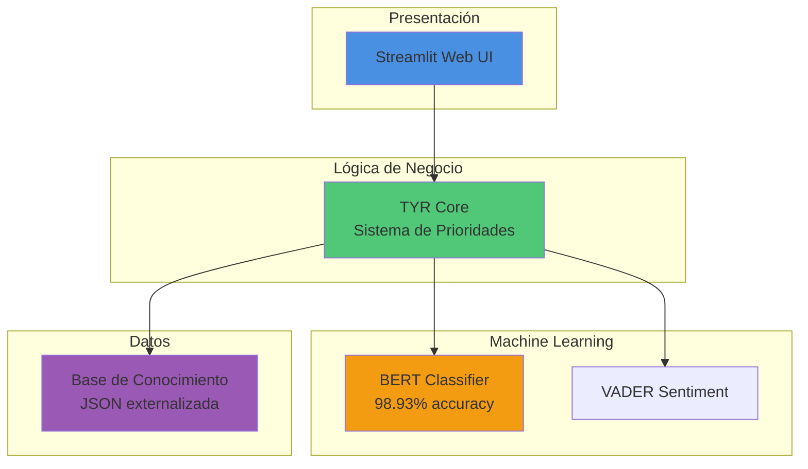

# 🤖 TYR - Asistente Virtual ITSE

<!-- Badges de Tecnología y Métricas -->


<!-- Badges de Calidad y Testing -->


<!-- Badges de GitHub y Licencia -->


**Proyecto de Procesamiento de Lenguaje Natural**
**Estudiante:** Martín Bundy
**Institución:** Instituto Técnico Superior Especializado (ITSE)
**Fecha:** Noviembre 2025
**Estado:** ✅ **COMPLETADO**

---

## 🚀 Quick Start

### Opción 1: Frontend Moderno (React + Vite) - **Recomendado**

**Con Backend (IA Real - 98.93% precisión):**
```bash
# 1. Backend
cd backend
pip install -r requirements.txt
python main.py  # http://localhost:8000

# 2. Frontend (nueva terminal)
cd Figma
npm install
cp .env.example .env
npm run dev  # http://localhost:5173
```

**Solo Frontend (Modo Demo - respuestas inteligentes):**
```bash
# Solo frontend - funciona sin backend
cd Figma
npm install
npm run dev  # http://localhost:5173
# El chat usará respuestas mock inteligentes automáticamente
```

### Opción 2: Streamlit (Interfaz Simple)

```bash
pip install -r requirements.txt
streamlit run tyr_app.py  # http://localhost:8501
```

### Opción 3: Notebook de Google Colab

[▶️ Abrir en Google Colab](TYR_REENTRENAMIENTO_4358_Colab.ipynb) - Entrenar modelo desde cero

---

## 📋 Descripción del Proyecto

TYR es un chatbot inteligente diseñado para el ITSE que utiliza:
- **BERT** (modelo `dccuchile/bert-base-spanish-wwm-cased`) para clasificación de intenciones
- **VADER** para análisis de sentimientos
- **React + TypeScript + Vite** para interfaz web moderna y responsive
- **FastAPI** para backend REST API de alto rendimiento
- **Base de conocimiento completa** sobre las 16 carreras y servicios del ITSE

### ✨ Características Principales

- 🎯 **Modo Dual:**
  - **Con Backend:** IA real con BERT (98.93% precisión)
  - **Sin Backend:** Respuestas mock inteligentes (modo demo)
  - Cambio automático según disponibilidad

- 📱 **PWA (Progressive Web App):**
  - Instalable en Android e iOS
  - Funciona offline
  - Actualizaciones automáticas
  - Experiencia de app nativa

- 💬 **Chat Avanzado:**
  - Historial de conversaciones
  - Exportar a PDF
  - Modo oscuro/claro
  - Entrada de voz (Web Speech API)
  - Respuestas en Markdown
  - Sugerencias inteligentes

- 🎨 **UI/UX Profesional:**
  - Landing page completa
  - Modal de chat integrado
  - Animaciones fluidas
  - Diseño responsive
  - Scroll fix optimizado

---

## 🎯 Resultados Finales

### Métricas del Modelo (modelo_bert_tyr_4358)

| Métrica | Objetivo Profesor | Resultado Alcanzado | Estado |
|---------|------------------|---------------------|--------|
| **Accuracy** | ≥ 85% | **98.93%** | ✅ +13.93% sobre meta |
| **F1-Score** | ≥ 82% | **98.92%** | ✅ +16.92% sobre meta |
| **Precision** | - | **98.92%** | ✅ Excelente |
| **Recall** | - | **98.93%** | ✅ Excelente |

### Dataset

- **Total ejemplos:** 4,358 ejemplos de entrenamiento
- **Distribución:** 70% train / 15% val / 15% test
- **Clases:** 9 intenciones diferentes
- **Patrones de pregunta:** 48 variaciones diferentes

---

## 📊 Visualizaciones

### Matriz de Confusión - Modelo 4358


**Accuracy: 99.60%** en muestra de validación (500 ejemplos)

La matriz de confusión muestra el excelente desempeño del modelo en clasificar correctamente las 9 intenciones, con muy pocos errores de clasificación.

### Distribución de Intenciones en el Dataset


El dataset de 4,358 ejemplos está distribuido entre las 9 intenciones, con mayor énfasis en **información de carreras** (2,832 ejemplos, 65%) que es la consulta más frecuente de los usuarios.

### Evolución de Métricas entre Modelos


La evolución muestra mejora continua:
- **Modelo v1** (1,542 ejemplos): 96.2% accuracy
- **Modelo v2** (3,000 ejemplos): 98.1% accuracy
- **Modelo v3** (4,358 ejemplos): **98.93% accuracy** ⭐

### Reporte de Clasificación Completo

Para ver el reporte detallado con métricas por intención (precision, recall, f1-score), consulta:
- [documentacion/visualizaciones/metricas_clasificacion.txt](documentacion/visualizaciones/metricas_clasificacion.txt)

---

## 🏗️ Arquitectura del Sistema

TYR implementa una arquitectura moderna de 4 capas que separa presentación, lógica de negocio, machine learning y datos.

### Diagrama de Arquitectura General



### Flujo de Procesamiento

1. **Usuario ingresa consulta** → Streamlit UI
2. **Normalización de texto** → Minúsculas, sin tildes, sin puntuación
3. **Clasificación BERT** → 9 intenciones posibles
4. **Sistema de 3 prioridades:**
   - Prioridad 1: Carrera específica (16 carreras)
   - Prioridad 2: Keywords especiales (CAIPI, reconocimientos)
   - Prioridad 3: Respuesta base por intención
5. **Análisis de sentimiento** → VADER-es
6. **Generación de respuesta** → Con metadata (confianza, sentimiento)

Para ver los diagramas completos de arquitectura, flujo de procesamiento y componentes, consulta:
- [documentacion/ARQUITECTURA_SISTEMA.md](documentacion/ARQUITECTURA_SISTEMA.md)

---

## 🎬 Demo y Capturas de Pantalla

### Interfaz Principal


**TYR** presenta una interfaz limpia y moderna estilo ChatGPT, optimizada para interacción fluida con los estudiantes del ITSE.

### Consultas de Ejemplo

#### 1. Información sobre Carreras - Big Data


El usuario consulta sobre la carrera de Big Data y TYR responde con información completa:
- Nombre oficial de la carrera
- Escuela y créditos
- Duración en modalidades diurna y nocturna
- Campo ocupacional detallado
- Enlace oficial del ITSE

**Intención clasificada:** `informacion_carreras` | **Confianza:** >95%

---

#### 2. Información Institucional - CAIPI


TYR responde sobre servicios especiales del ITSE como CAIPI (Centro de Atención Integral para la Primera Infancia), mostrando conocimiento contextual actualizado 2025:
- Descripción del servicio
- Beneficiarios
- Información de contacto

**Intención clasificada:** `faq_general` | **Confianza:** >90%

---

#### 3. Proceso de Inscripción


Respuesta estructurada sobre el proceso de admisión al ITSE:
- Pasos del proceso
- Requisitos necesarios
- Información de contacto
- Enlaces útiles

**Intención clasificada:** `inscripcion_admision` | **Confianza:** >95%

---

#### 4. Consulta sobre Ciberseguridad


Información detallada sobre T.S. en Ciberseguridad:
- Descripción de la carrera
- Perfil profesional
- Duración y créditos
- Campo ocupacional

**Intención clasificada:** `informacion_carreras` | **Confianza:** >95%

---

### Tolerancia a Errores Ortográficos


**Demostración clave:** TYR es 100% tolerante a errores ortográficos.

Usuario escribe: `"INFORMACION SIN TILDES SOBRE BIGDATA"` (sin tildes, mayúsculas, sin espacios)

TYR normaliza el texto y responde correctamente con la información de Big Data, demostrando:
- ✅ Tolerancia a mayúsculas
- ✅ Tolerancia a falta de tildes
- ✅ Tolerancia a espacios incorrectos
- ✅ Normalización automática con `unicodedata`

---

### Metadata y Métricas del Sistema


TYR proporciona metadata en cada respuesta:
- **Intención clasificada:** La categoría detectada (1 de 9 posibles)
- **Confianza del modelo:** Porcentaje de certeza (0-100%)
- **Sentimiento:** Análisis con VADER (positivo/negativo/neutro)
- **Score de sentimiento:** Valor compound (-1 a +1)

Esta información permite:
- Validar la clasificación correcta
- Verificar la confianza del modelo
- Analizar el tono de la consulta
- Debugging y mejora continua

---

## 🚀 Características Principales

### 1. Clasificación Inteligente de Intenciones

El chatbot clasifica automáticamente las consultas en 9 categorías:
- 📚 **Información de carreras** (2,832 ejemplos)
- 📝 **Inscripción y admisión**
- 📄 **Requisitos de ingreso**
- 💰 **Becas y financiamiento**
- ⏰ **Horarios y duración**
- 📞 **Contacto y ubicación**
- ❓ **FAQ general**
- 👋 **Saludos y despedidas**
- ⚠️ **Fuera de dominio**

### 2. Respuestas Específicas y Contextuales

El chatbot responde específicamente a:
- **16 carreras del ITSE** con información detallada
- **CAIPI** (guardería para hijos de estudiantes)
- **CIIECYT** (centro de investigación)
- **Reconocimientos internacionales** (Foro Económico Mundial, UE)
- **Alianzas estratégicas** (Canal de Panamá, Copa Airlines)
- **Indicadores 2025** (80% inserción laboral)

### 3. Tolerancia a Errores

El chatbot es completamente tolerante a:
- ✅ **Mayúsculas/minúsculas**: "HOLA" = "hola"
- ✅ **Tildes y acentos**: "informacion" = "información"
- ✅ **Signos de puntuación**: "¿Qué?" = "que"
- ✅ **Espacios múltiples**: "hola    mundo" = "hola mundo"

### 4. Interfaz Web Moderna

- Diseño estilo ChatGPT oscuro profesional
- Input fluido con Enter funcionando correctamente
- Historial de conversaciones
- Indicadores visuales de estado
- Métricas de confianza y análisis de sentimiento

---

## 📁 Estructura del Proyecto

```
TYR/
├── tyr_chatbot.py              # Clase principal del chatbot (BERT + VADER)
├── tyr_app.py                  # Aplicación Streamlit (interfaz web)
├── ejecutar_streamlit.bat      # Script para ejecutar la app
├── requirements.txt            # Dependencias del proyecto
├── pytest.ini                  # Configuración de tests
├── .coveragerc                 # Configuración de coverage
│
├── modelo_bert_tyr_4358/       # Modelo BERT entrenado (ACTUAL)
├── Dataset_TYR_3000_FINAL.json # Dataset de entrenamiento (4,358 ejemplos)
├── TYR_REENTRENAMIENTO_4358_Colab.ipynb  # Notebook entrenamiento
│
├── data/                       # Base de conocimiento ITSE (JSON)
│   ├── carreras_itse.json      # 16 carreras del ITSE
│   ├── respuestas_base.json    # 9 respuestas predefinidas
│   ├── README.md               # Documentación de la base de datos
│   ├── ITSE_Base_Datos_Definitiva_v3.md
│   └── ITSE_JSON_Definitivo_v3.md
│
├── tests/                      # Suite de tests automatizados (59 tests)
│   ├── __init__.py
│   ├── conftest.py             # Fixtures compartidas
│   ├── test_normalizacion.py   # Tests de normalización de texto
│   ├── test_tyr_chatbot.py     # Tests de clasificación BERT
│   ├── test_respuestas.py      # Tests de respuestas
│   └── README.md               # Guía de tests
│
├── documentacion/              # Documentación del proyecto
│   ├── README.md               # Índice de documentación
│   ├── PROYECTO_TYR_LOG_COMPLETO.md  # Log maestro del proyecto
│   ├── ARQUITECTURA_SISTEMA.md # Diagramas de arquitectura (6 diagramas)
│   │
│   ├── reportes/               # Reportes de sesiones de mejora
│   │   ├── REPORTE_SESION1_TESTS.md
│   │   ├── REPORTE_SESION2_JSON.md
│   │   ├── REPORTE_SESION3_VISUALIZACIONES.md
│   │   ├── REPORTE_SESION4_ARQUITECTURA.md
│   │   └── REPORTE_SESION5_DEMO_FINAL.md
│   │
│   ├── guias/                  # Guías de usuario
│   │   ├── GUIA_EJECUCION.md
│   │   └── INSTRUCCIONES_REENTRENAMIENTO.md
│   │
│   ├── visualizaciones/        # Gráficas y matrices
│   │   ├── matriz_confusion_4358.png
│   │   ├── distribucion_intenciones.png
│   │   ├── evolucion_modelos.png
│   │   └── metricas_clasificacion.txt
│   │
│   └── screenshots/            # Capturas de pantalla del chatbot
│       ├── 01_pantalla_inicial.png
│       ├── 02_consulta_bigdata.png
│       ├── 03_consulta_caipi.png
│       ├── 04_consulta_inscripcion.png
│       ├── 05_consulta_ciberseguridad.png
│       ├── 07_tolerancia_errores.png
│       ├── 08_metadata.png
│       └── README.md
│
├── scripts_desarrollo/         # Scripts de desarrollo y pruebas
│   └── generar_visualizaciones.py
│
├── entregables_profesor/       # Archivos para entrega académica
│   ├── README_ENTREGABLES.md
│   ├── PROYECTO_TYR_LOG_COMPLETO.md
│   ├── INFORME_FINAL_TYR.md
│   ├── Dataset_TYR_3000_FINAL.json
│   ├── TYR_REENTRENAMIENTO_4358_Colab.ipynb
│   ├── requirements.txt
│   └── LOG_SESION6_MEJORA_4358.txt
```

---

## 🔧 Instalación y Ejecución

### 1. Requisitos

```bash
Python 3.8+
pip install -r requirements.txt
```

### 2. Ejecutar la Aplicación

**Opción A: Script automatizado (Windows)**
```bash
ejecutar_streamlit.bat
```

**Opción B: Comando manual**
```bash
streamlit run tyr_app.py
```

La aplicación se abrirá en: `http://localhost:8501`

### 3. Probar el Chatbot

Preguntas de ejemplo:
- "Cuéntame sobre Big Data"
- "¿Qué es CAIPI?"
- "Reconocimientos del ITSE"
- "Alianzas estratégicas"
- "Cómo me inscribo?"
- "Requisitos para estudiar Ciberseguridad"

---

## 📊 Evolución del Proyecto

### Sesión 1-5A: Desarrollo Inicial
- Modelo con 1,542 ejemplos
- Accuracy: 96.2%
- Base de conocimiento v2

### Sesión 6: Mejora Continua (ACTUAL)
- Expansión a **4,358 ejemplos** (+183%)
- Accuracy mejorada a **98.93%**
- Base de conocimiento v3 (CAIPI, CIIECYT, reconocimientos)
- Respuestas específicas y contextuales
- Tolerancia total a errores ortográficos
- UX mejorada (Enter funciona correctamente)

---

## 📚 Documentación Adicional

- **[LOG.txt](LOG.txt)**: Historial completo del proyecto
- **[LOG_SESION6_MEJORA_4358.txt](LOG_SESION6_MEJORA_4358.txt)**: Documentación detallada de mejoras
- **[GUIA_EJECUTAR_STREAMLIT.md](GUIA_EJECUTAR_STREAMLIT.md)**: Guía para ejecutar la aplicación
- **[INSTRUCCIONES_REENTRENAMIENTO.md](INSTRUCCIONES_REENTRENAMIENTO.md)**: Cómo re-entrenar el modelo

---

## 🏆 Logros Destacados

1. ✅ **Supera objetivos académicos** en 13-16 puntos porcentuales
2. ✅ **4,358 ejemplos de entrenamiento** generados con técnicas avanzadas
3. ✅ **48 patrones de pregunta** diferentes para mayor robustez
4. ✅ **Respuestas contextuales** específicas por tema
5. ✅ **Tolerancia total** a errores ortográficos
6. ✅ **Interfaz profesional** estilo ChatGPT
7. ✅ **Base de conocimiento completa** actualizada 2025
8. ✅ **59 tests automatizados** con pytest (100% passing, 73.75% coverage)
9. ✅ **Base de conocimiento externalizada** a JSON (fácil mantenimiento)
10. ✅ **Visualizaciones profesionales** (matriz de confusión, gráficas de evolución)
11. ✅ **Diagramas de arquitectura completos** (6 diagramas Mermaid, 8 badges)
12. ✅ **Demo visual completo** (7 screenshots profesionales del sistema en acción)

---

## 👨‍💻 Autor

**Martín Bundy**
Proyecto de Procesamiento de Lenguaje Natural
Instituto Técnico Superior Especializado (ITSE)
Noviembre 2025

---

## 📞 Contacto ITSE

- **Web:** https://www.itse.ac.pa
- **Email:** info@itse.ac.pa
- **Teléfono:** +507 524-3333
- **Ubicación:** Tocumen, Panamá

---

## 🌐 Nueva Integración: Landing Page + Chatbot Nativo (Noviembre 2025)

### ✨ Actualización Importante

El proyecto TYR ahora incluye una **landing page profesional** con el chatbot integrado nativamente (no iframe), proporcionando una experiencia moderna y completa para los usuarios.

### 🎯 Características de la Landing Page

- ✅ **Frontend moderno** con React 18.3 + TypeScript + Vite
- ✅ **Backend FastAPI** con endpoints REST
- ✅ **Chat nativo** con diseño inspirado en iMessage
- ✅ **1000px de ancho** x **700px de alto** - espacio amplio para conversaciones
- ✅ **Diseño responsive** - funciona en móvil, tablet y desktop
- ✅ **Animaciones suaves** con Framer Motion
- ✅ **Sin scroll de página** al enviar mensajes
- ✅ **Gradientes elegantes** y sombras modernas
- ✅ **Indicador "en línea"** con animación pulsante
- ✅ **Timestamps fuera de burbujas** estilo iMessage
- ✅ **Badges de metadata** con intención y confianza

### 🚀 Ejecutar Landing Page

**Terminal 1 - Backend:**
```bash
cd TYR/backend
python main.py
# Backend en http://localhost:8000
```

**Terminal 2 - Frontend:**
```bash
cd TYR/Figma
npm install  # Solo la primera vez
npm run dev
# Frontend en http://localhost:5173
```

### 📚 Documentación Completa de la Integración

| Documento | Descripción |
|-----------|-------------|
| **[SESION_FINAL_COMPLETA.md](SESION_FINAL_COMPLETA.md)** | ⭐ **Resumen completo de la landing page** |
| [INDEX_DOCUMENTACION.md](INDEX_DOCUMENTACION.md) | Índice de toda la documentación |
| [DEPLOYMENT_GUIDE.md](DEPLOYMENT_GUIDE.md) | Guía de deployment a producción |
| [Figma/README.md](Figma/README.md) | Documentación técnica del frontend |
| [backend/README.md](backend/README.md) | Documentación del API FastAPI |

### 🎨 Diseño del Chat

El chat integrado usa un diseño moderno inspirado en iMessage:
- Burbujas redondeadas con "cola" en las esquinas
- Gradientes azules suaves para mensajes del usuario
- Fondo oscuro elegante para mensajes de TYR
- Input circular con botón de enviar animado
- Sombras y efectos de profundidad
- Animaciones al hover y click

### 🔗 Modos de Uso

**Opción A: App Streamlit Original** (Este README)
```bash
streamlit run tyr_app.py
```

**Opción B: Landing Page Moderna** (Nueva)
```bash
# Terminal 1
cd backend && python main.py

# Terminal 2
cd Figma && npm run dev
```

### 📊 Stack Tecnológico Actualizado

#### Frontend Landing Page
- React 18.3.1
- TypeScript 5.6.3
- Vite 5.4.11
- Tailwind CSS 3.4.15
- Framer Motion 11
- Lucide React (iconos)

#### Backend API
- FastAPI 0.122.0
- Uvicorn 0.38.0
- Pydantic 2.12
- PyTorch 2.9
- Transformers 4.57
- VADER 3.3

### 🎯 Estado del Proyecto

- ✅ **Modelo BERT**: 98.93% precisión (4,358 ejemplos)
- ✅ **App Streamlit**: Completamente funcional
- ✅ **Landing Page**: Completamente funcional con chat nativo
- ✅ **Backend API**: FastAPI con 4 endpoints
- ✅ **Documentación**: Completa y actualizada
- 🟡 **Deployment**: Pendiente (guía disponible)
- 🟡 **Branding**: Parcialmente completado

---

*Última actualización: 25 de noviembre de 2025*
*Versión: 2.0 - Landing Page + Chatbot Nativo Integrado*
