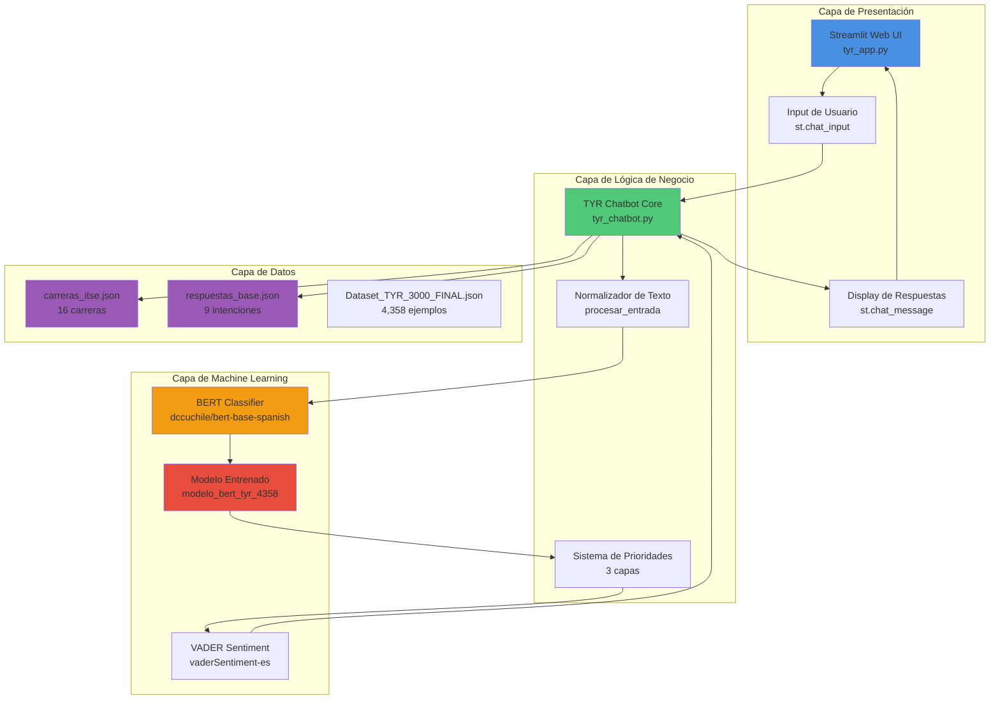
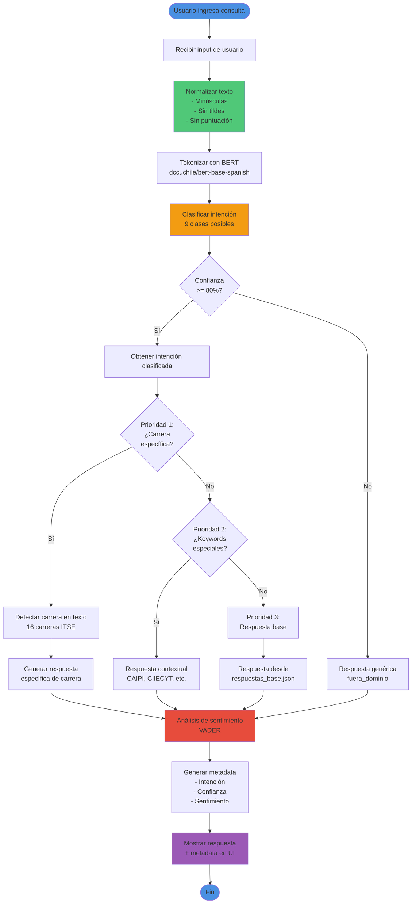
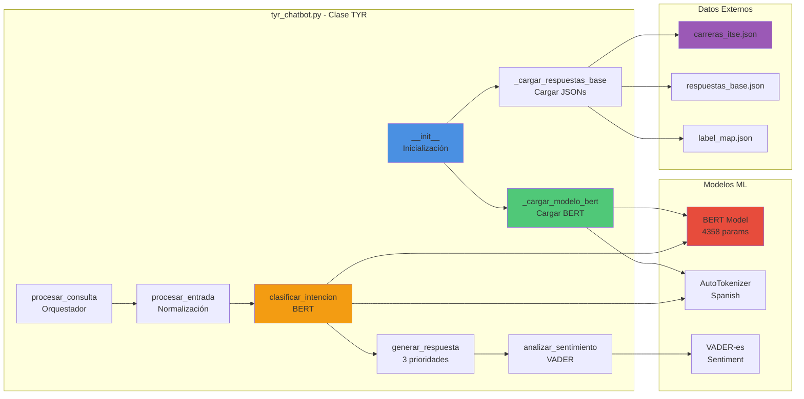
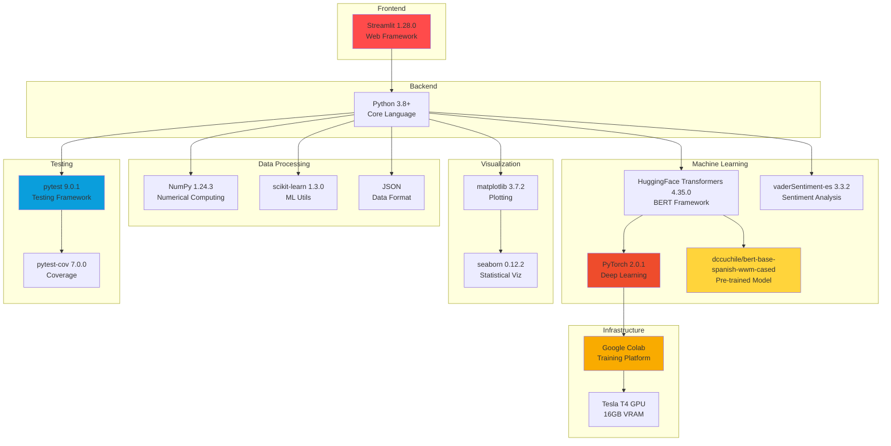
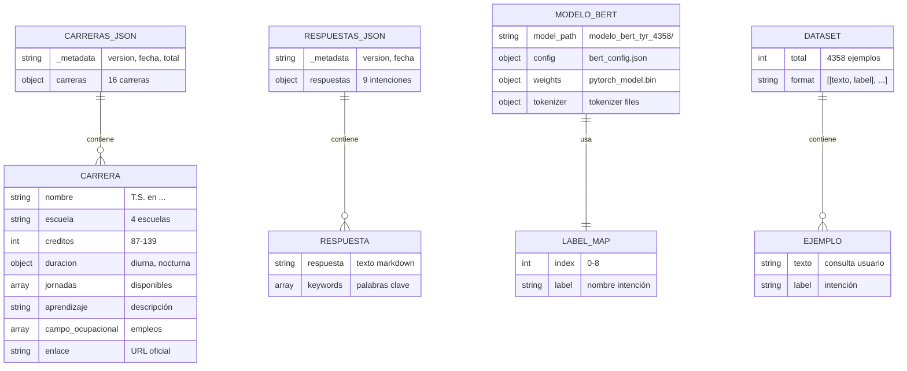
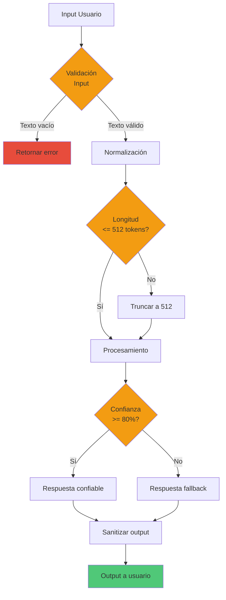

# 🏗️ Arquitectura del Sistema TYR

**Proyecto:** TYR - Asistente Virtual ITSE
**Autor:** Martín Bundy
**Fecha:** 23 de Noviembre 2025
**Versión:** 1.0

---

## 📋 Índice

1. [Arquitectura General del Sistema](#arquitectura-general)
2. [Flujo de Procesamiento de Consultas](#flujo-de-procesamiento)
3. [Componentes del Sistema](#componentes-del-sistema)
4. [Stack Tecnológico](#stack-tecnológico)
5. [Base de Datos y Almacenamiento](#base-de-datos)

---

## 🏛️ Arquitectura General del Sistema



### Descripción de Capas

**Capa de Presentación (Streamlit)**
- Interfaz web moderna estilo ChatGPT
- Input fluido con soporte de Enter
- Historial de conversaciones
- Métricas en tiempo real

**Capa de Lógica de Negocio (TYR Core)**
- Normalización de texto (tolerancia a errores)
- Sistema de prioridades de 3 capas
- Enrutamiento inteligente de respuestas
- Análisis de sentimientos

**Capa de Machine Learning**
- BERT fine-tuned en español
- Clasificación de 9 intenciones
- Análisis de sentimientos con VADER
- Confianza > 80% para respuestas

**Capa de Datos**
- Base de conocimiento externalizada
- 16 carreras del ITSE
- 9 respuestas predefinidas
- Dataset de 4,358 ejemplos

---

## 🔄 Flujo de Procesamiento de Consultas



### Descripción del Flujo

**1. Entrada de Usuario**
- Usuario escribe consulta en interfaz Streamlit
- Input capturado con `st.chat_input()`

**2. Normalización (Paso crítico)**
- Conversión a minúsculas
- Eliminación de tildes con `unicodedata`
- Remoción de puntuación
- Limpieza de espacios múltiples

**3. Clasificación con BERT**
- Tokenización con tokenizer de BERT
- Forward pass por modelo fine-tuned
- Softmax para probabilidades
- Selección de intención con mayor confianza

**4. Sistema de Prioridades (3 Capas)**

**Prioridad 1:** Detección de carreras específicas
- Busca keywords de 16 carreras en texto normalizado
- Genera respuesta detallada de la carrera
- Ejemplo: "big data" → Info completa de T.S. en Big Data

**Prioridad 2:** Keywords especiales
- CAIPI, CIIECYT, reconocimientos, alianzas
- Respuestas contextuales específicas
- Información actualizada 2025

**Prioridad 3:** Respuesta base por intención
- Usa `respuestas_base.json`
- Respuesta genérica de la intención clasificada

**5. Análisis de Sentimiento**
- VADER-es analiza el sentimiento de la consulta
- Categoría: positivo/negativo/neutro
- Score compound: -1 a +1

**6. Generación de Metadata**
- Intención detectada
- Confianza del modelo (%)
- Sentimiento y score

---

## 🧩 Componentes del Sistema



### Descripción de Componentes

**Clase TYR (tyr_chatbot.py)**

```python
class TYR:
    def __init__(self, modelo_path, device='cpu'):
        # Carga BERT, VADER, y datos JSON

    def procesar_entrada(self, texto: str) -> str:
        # Normalización completa de texto

    def clasificar_intencion(self, texto: str) -> tuple:
        # Clasificación con BERT
        # Returns: (intención, confianza, probabilidades)

    def analizar_sentimiento(self, texto: str) -> dict:
        # Análisis con VADER-es
        # Returns: {categoria, score_compound}

    def generar_respuesta(self, texto_norm: str, intencion: str) -> str:
        # Sistema de 3 prioridades
        # Returns: respuesta contextual

    def procesar_consulta(self, texto: str) -> tuple:
        # Orquestador principal
        # Returns: (respuesta, metadata)
```

**Métodos Privados**
- `_cargar_modelo_bert()`: Carga modelo desde disco
- `_cargar_carreras_desde_json()`: Carga 16 carreras
- `_cargar_respuestas_desde_json()`: Carga 9 respuestas
- `_obtener_carreras_hardcodeadas()`: Fallback carreras
- `_obtener_respuestas_hardcodeadas()`: Fallback respuestas

---

## 🛠️ Stack Tecnológico



### Versiones de Dependencias

| Componente | Versión | Propósito |
|------------|---------|-----------|
| **Python** | 3.8+ | Lenguaje base |
| **transformers** | 4.35.0 | Framework BERT |
| **torch** | 2.0.1 | Deep learning |
| **streamlit** | 1.28.0 | Interfaz web |
| **vaderSentiment-es** | 3.3.2 | Análisis sentimientos |
| **numpy** | 1.24.3 | Computación numérica |
| **scikit-learn** | 1.3.0 | Métricas ML |
| **matplotlib** | 3.7.2 | Visualizaciones |
| **seaborn** | 0.12.2 | Gráficas estadísticas |
| **pytest** | 9.0.1 | Tests automatizados |
| **pytest-cov** | 7.0.0 | Coverage de tests |

---

## 💾 Base de Datos y Almacenamiento



### Estructura de Archivos JSON

**carreras_itse.json** (~83 KB)
```json
{
  "_metadata": {
    "version": "1.0",
    "fecha_actualizacion": "2025-11-23",
    "total_carreras": 16,
    "escuelas": [...]
  },
  "desarrollo de software": {
    "nombre": "T.S. en Desarrollo de Software",
    "escuela": "Innovación Digital",
    "creditos": 112,
    "duracion": {"diurna": "2 años 4 meses", "nocturna": "3 años"},
    "jornadas": ["diurna", "nocturna"],
    "aprendizaje": "...",
    "campo_ocupacional": [...],
    "enlace": "https://..."
  },
  ...
}
```

**respuestas_base.json** (~8 KB)
```json
{
  "_metadata": {
    "version": "1.0",
    "fecha_actualizacion": "2025-11-23",
    "total_intenciones": 9
  },
  "saludo_despedida": {
    "respuesta": "...",
    "keywords": [...]
  },
  ...
}
```

**label_map.json**
```json
{
  "0": "becas_financiamiento",
  "1": "contacto_ubicacion",
  "2": "faq_general",
  "3": "fuera_dominio",
  "4": "horarios_duracion",
  "5": "informacion_carreras",
  "6": "inscripcion_admision",
  "7": "requisitos_ingreso",
  "8": "saludo_despedida"
}
```

**Dataset_TYR_3000_FINAL.json** (4,358 ejemplos)
```json
[
  ["¿Cuéntame sobre Big Data?", "informacion_carreras"],
  ["¿Cómo me inscribo?", "inscripcion_admision"],
  ["¿Qué documentos necesito?", "requisitos_ingreso"],
  ...
]
```

---

## 🔐 Seguridad y Validación



### Medidas de Seguridad

1. **Validación de Input**
   - Verificación de texto no vacío
   - Sanitización de caracteres especiales
   - Límite de longitud (512 tokens)

2. **Validación de Output**
   - Confianza mínima 80%
   - Respuesta fallback para baja confianza
   - Sanitización de respuestas

3. **Manejo de Errores**
   - Try-catch en carga de modelos
   - Fallback a respuestas hardcodeadas
   - Logs de errores informativos

4. **Protección de Datos**
   - No almacenamiento de conversaciones
   - No logging de información personal
   - Procesamiento en memoria

---

## 📊 Métricas y Monitoreo

El sistema incluye métricas en tiempo real:

- **Confianza del modelo**: 0-100%
- **Intención clasificada**: 9 categorías
- **Sentimiento**: positivo/negativo/neutro
- **Score sentimiento**: -1 a +1
- **Tiempo de respuesta**: ~0.5-2 segundos

---

## 🎯 Conclusión

El sistema TYR implementa una arquitectura moderna de 4 capas que separa claramente:

- **Presentación** (Streamlit)
- **Lógica de negocio** (TYR Core)
- **Machine Learning** (BERT + VADER)
- **Datos** (JSON externalizados)

Esta separación permite:
- ✅ Fácil mantenimiento y actualización
- ✅ Testing independiente de componentes
- ✅ Escalabilidad horizontal
- ✅ Reutilización de componentes
- ✅ Actualización de datos sin código

---

**Fecha de creación:** 23 de Noviembre 2025
**Autor:** Martín Bundy
**Proyecto:** TYR - Asistente Virtual ITSE
